# Architecture

## System Overview

Durable Researcher is a fault-tolerant deep research agent. Every LLM turn is checkpointed to PostgreSQL so the agent can resume after crashes without losing progress. It uses Steel Cloud for browser automation and a configurable LLM provider for reasoning.

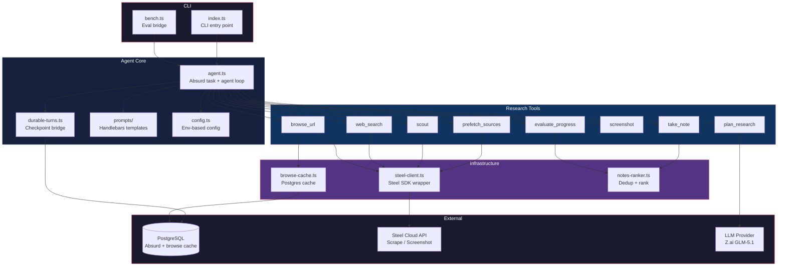

---

## Durable Turns Pattern

The core innovation. Every LLM message (user, assistant, tool result) is persisted as an Absurd step in PostgreSQL. On crash, the agent replays all checkpointed messages, rebuilds in-memory state (notes, scraped URLs), and continues from the last checkpoint.

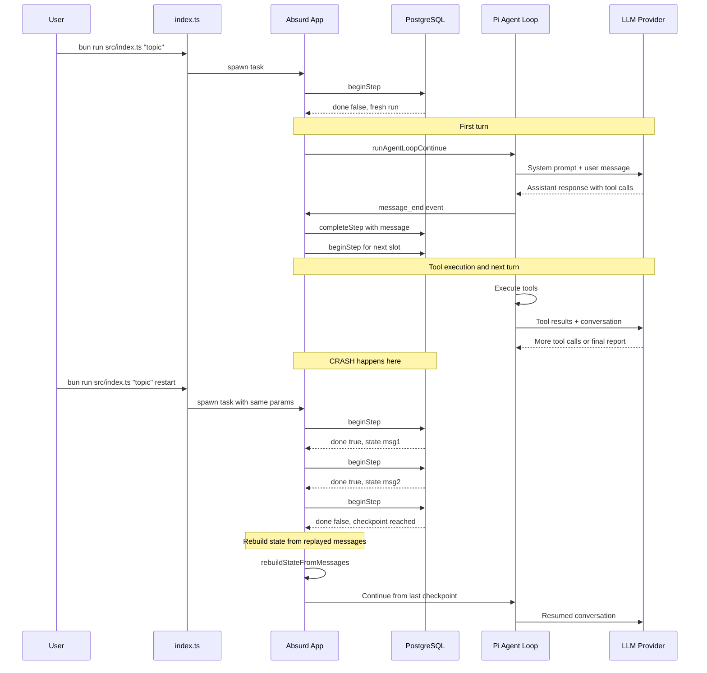

### State Rebuilding

On resume, `rebuildStateFromMessages()` walks the message history to reconstruct:

- **Notes** — from successful `take_note` tool calls + results
- **Scraped URLs** — from successful `browse_url`, `prefetch_sources`, and `scout` results

This means the agent never re-browses pages it already visited and never loses research notes.

---

## Research Tool Flow

The agent uses 8 tools in a structured research workflow. The LLM orchestrates which tools to call and when, guided by the system prompt and steering messages.

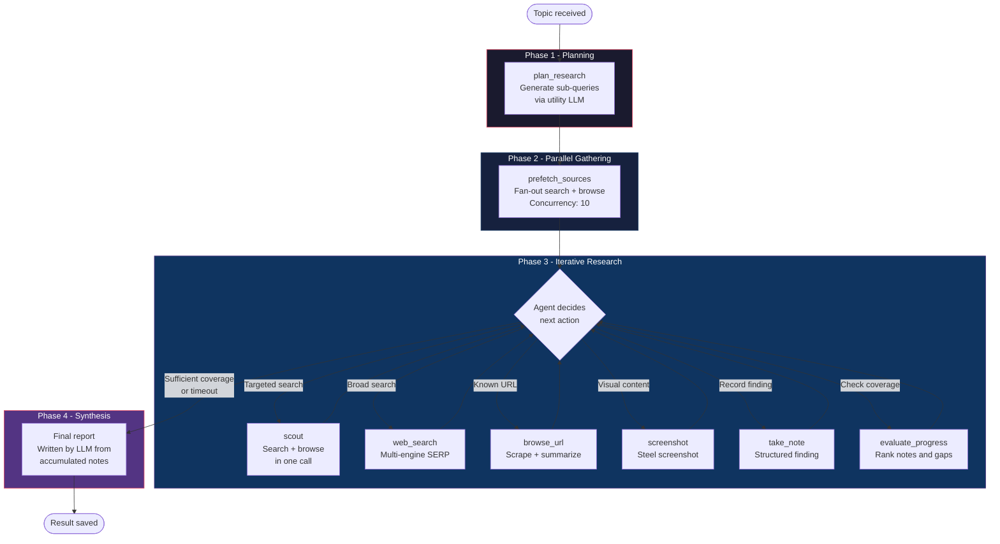

### Tool Summary

| Tool | Purpose | External Calls |
|------|---------|---------------|
| `plan_research` | Generate sub-queries via utility LLM | LLM (60s timeout) |
| `prefetch_sources` | Parallel search+browse all sub-queries | Steel (scrape) x N |
| `scout` | Combined search+browse in one call | Steel (scrape) |
| `web_search` | Multi-engine SERP (Bing > DDG > Google) | Steel (scrape) |
| `browse_url` | Scrape page, smart summarize | Steel (scrape), LLM (>4KB), Cache |
| `screenshot` | Capture page screenshot | Steel (screenshot) |
| `take_note` | Record structured finding | None (in-memory) |
| `evaluate_progress` | Show coverage, rank notes, suggest gaps | None (in-memory) |

---

## Steering and Limits

The agent loop has three mechanisms to prevent runaway execution:

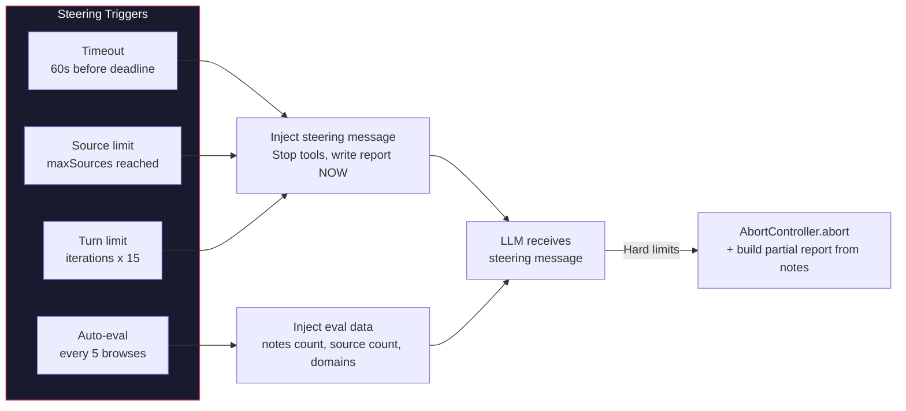

- **Timeout steering**: 60s before `MAX_DURATION`, a user message is injected telling the agent to stop and write the report. At the hard deadline, `AbortController.abort()` kills the loop and a partial report is built from accumulated notes.
- **Auto-evaluation**: After every 5 browses without an explicit `evaluate_progress` call, the system injects a status message showing source/turn counts, confidence distribution, and domain diversity.
- **Hard limits**: Source count (`maxSources`, default 20) and turn count (`iterations x 15`) are enforced.

---

## Browse Cache

A PostgreSQL-backed cache prevents re-scraping pages across crashes and task extensions.

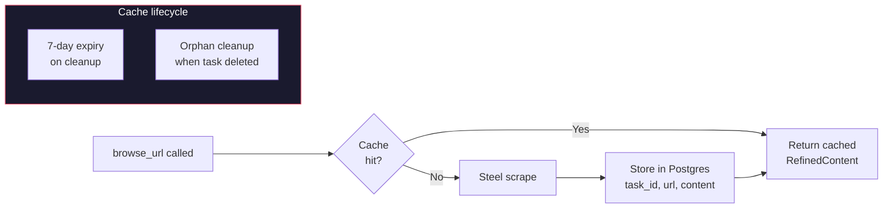

---

## Content Processing Pipeline

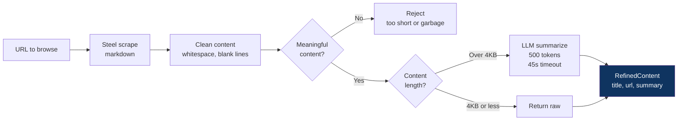

---

## Note Deduplication and Ranking

Notes are deduplicated using trigram Jaccard similarity and ranked by quality.

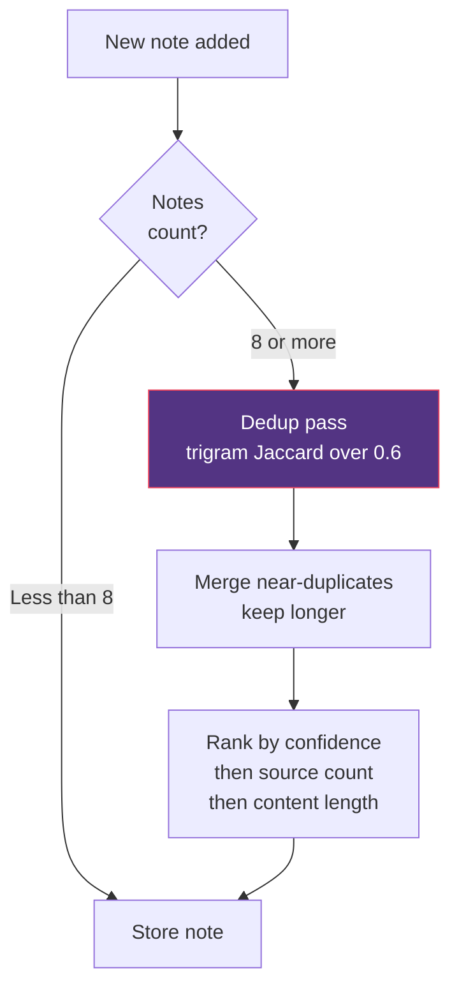

---

## Evaluation Pipeline

A separate Python harness benchmarks the agent against academic datasets.

```mermaid
flowchart LR
    subgraph stage1[Stage 1 - Download]
        DL["bench download all"] --> HF["HuggingFace<br/>ResearchRubrics 101 tasks<br/>DRACO 100 tasks"]
    end

    subgraph stage2[Stage 2 - Run Agent]
        RUN["bench run"] --> AGENT_RUN["Spawn agent subprocess<br/>per task"]
        AGENT_RUN --> REPORTS["responses/task_id.md"]
    end

    subgraph stage3[Stage 3 - Judge]
        JUDGE["bench judge"] --> LLM_JUDGE["LLM-as-Judge<br/>Gemini 2.5 Pro<br/>Gemini 3.1 Pro<br/>Claude Haiku 4.5"]
        LLM_JUDGE --> VERDICTS["results/model/task_id.jsonl"]
    end

    subgraph stage4[Stage 4 - Score]
        SCORE["bench score"] --> CALC["Normalized score"]
    end

    subgraph stage5[Stage 5 - Report]
        REPORT_CMD["bench report"] --> MD["Markdown summary<br/>per-section breakdowns"]
    end

    HF --> RUN
    REPORTS --> JUDGE
    VERDICTS --> SCORE
    CALC --> REPORT_CMD

    style stage1 fill:#1a1a2e,stroke:#e94560,color:#fff
    style stage2 fill:#16213e,stroke:#0f3460,color:#fff
    style stage3 fill:#0f3460,stroke:#533483,color:#fff
    style stage4 fill:#533483,stroke:#e94560,color:#fff
    style stage5 fill:#1a1a2e,stroke:#e94560,color:#fff
```

### Judge Providers

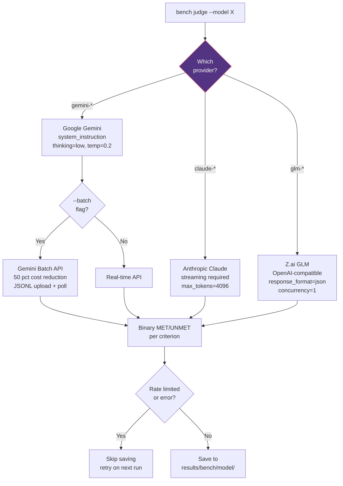

---

## CLI Lifecycle

The full lifecycle of a research task from the user's perspective:

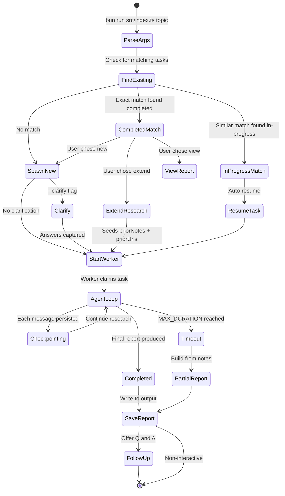

---

## Depth Configuration

| Depth | Iterations | Initial Queries | Max Turns | Use Case |
|-------|-----------|-----------------|-----------|----------|
| `quick` | 1 | 3 | 15 | Fast answers, simple topics |
| `standard` | 3 | 5 | 45 | Balanced research |
| `deep` | 5 | 8 | 75 | Comprehensive deep dives |

All configurable via `--depth` flag and `--max-sources`.

---

## External Dependencies

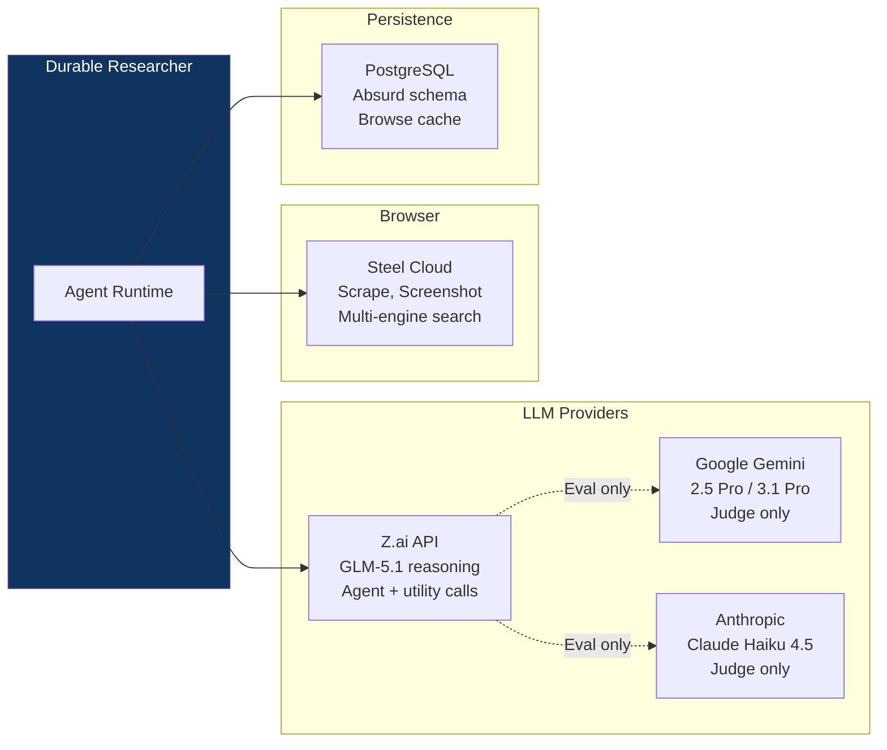

---

## File Map

```
src/
├── index.ts              CLI entry — arg parsing, task lifecycle, follow-up
├── agent.ts              Absurd task registration, agent loop, timeout steering
├── bench.ts              Headless eval bridge (single topic → file)
├── durable-turns.ts      Checkpoint load/persist, state rebuild, progress logging
├── types.ts              Shared types: ResearchParams, ResearchNote, ResearchResult
├── config.ts             Env-based config: model, reasoning, duration
├── content.ts            Text cleaning, truncation, token estimation
├── steel-client.ts       Steel SDK wrapper, multi-engine search, URL unwrapping
├── browse-cache.ts       Postgres-backed scrape cache (7-day expiry)
├── notes-ranker.ts       Trigram dedup (0.6 threshold), quality ranking
├── prompts.ts            Handlebars template loader
├── task-finder.ts        Find existing tasks (exact + LLM fuzzy match)
├── follow-up.ts          Interactive Q&A after research completes
├── clarify.ts            Pre-research scope narrowing
├── tools/
│   ├── plan.ts           plan_research — generate sub-queries
│   ├── prefetch.ts       prefetch_sources — parallel fan-out search+browse
│   ├── scout.ts          scout — combined search+browse in one call
│   ├── search.ts         web_search — multi-engine SERP
│   ├── browse.ts         browse_url — scrape + smart summarize
│   ├── screenshot.ts     screenshot — Steel screenshot capture
│   ├── note.ts           take_note — structured finding
│   └── evaluate.ts       evaluate_progress — coverage check
└── prompts/
    ├── system.hbs        Agent system prompt
    ├── plan.hbs          Research planning prompt
    ├── summarize.hbs     Content summarization prompt
    └── clarify.hbs       Clarification prompt

eval/
├── src/bench/
│   ├── cli.py            Typer CLI — download, run, judge, score, report
│   ├── data.py           Dataset download from HuggingFace
│   ├── runner.py         Agent subprocess execution
│   ├── judge.py          LLM-as-judge (Gemini, Anthropic, Z.ai)
│   ├── score.py          Scoring formulas (normalized, pass rate)
│   └── report.py         Markdown report generation
└── tests/                73 unit tests
```
