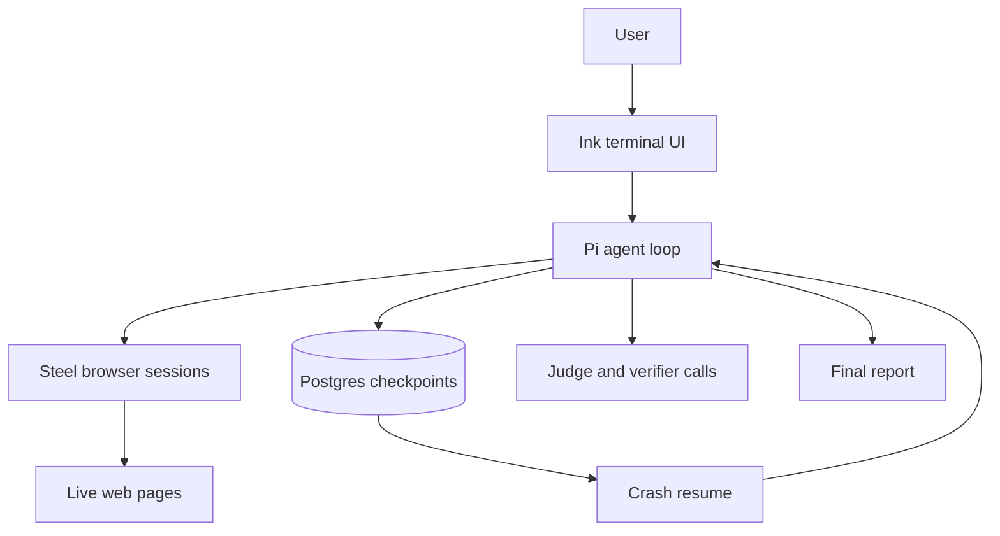
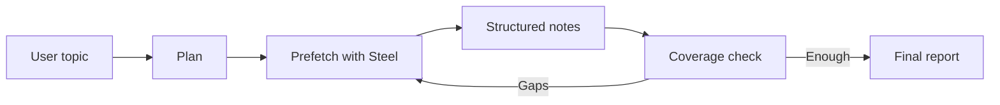

# Durable Researcher: building a research agent that survives its own failures

I built a self-hosted deep research agent. Then I rebuilt it, because the first version was good at the wrong thing.

The first version could write thoughtful overviews. It could plan sub-queries, browse in parallel, take notes, evaluate coverage, and produce a polished report. On broad synthesis tasks, it looked competent. On exact questions, it behaved like an overqualified essayist. Ask for a cash-flow figure from a filing and it would give you a careful report about the company.

Then I added a citation-verification layer. It parsed every citation in the final report, checked the cited claim against the agent's notes, and triggered a rewrite when the evidence was weak. It was clean, defensible, and obviously the kind of thing a research agent should have.

The evals said it made the product worse, so I switched the rewrite step off.

That was the project in miniature: build the thing that seems right, test it against real tasks, read the failures, and be willing to retire your own cleverness.

## The System

Durable Researcher takes a topic, plans sub-queries, runs them in parallel against real browser sessions on [Steel](https://steel.dev), takes structured notes, checks its own coverage, fills gaps, and writes a report. Steel mattered because the agent needed browsers, not just HTTP fetches. A lot of research failures happen on pages that render late, redirect, block basic scrapers, or hide the useful content behind browser behavior.

Every model message is checkpointed to Postgres as it happens. If the process dies, the next run resumes from the last checkpoint. The model does not know it crashed.

The stack is Bun and TypeScript, [Pi](https://github.com/earendil-works/pi) for the agent loop, [Absurd](https://github.com/earendil-works/absurd) for durable execution, Steel for browser sessions, Postgres for persistence, and a GLM model for reasoning. The terminal UI is built in Ink.

None of that is exotic. The product is in the fit between the pieces: durable execution, Steel-backed browser work, source notes, evals, and a UI that lets you interrupt the agent while it is still working.

## The Numbers, With The Caveats Up Front

There are two useful academic benchmarks for this kind of system. [ResearchRubrics](https://github.com/scaleai/researchrubrics) has 101 tasks with weighted criteria judged by an LLM. [DRACO](https://huggingface.co/datasets/perplexity-ai/draco), from Perplexity, has 100 tasks with a similar rubric shape.

| Benchmark | Judge | Tasks | Score | How to read it |
|---|---|---:|---:|---|
| ResearchRubrics | Gemini default | 10/101 | `0.598` | Promising, partial |
| DRACO | Gemini 3.1 Pro | 10/100 | `47.1%` | Paper-comparable, weak sample |
| DRACO | Claude Haiku | 100/100 | `69.4%` | Diagnostic only |

For reference, the published full-set ResearchRubrics scores are Gemini Deep Research at `0.615`, OpenAI Deep Research at `0.597`, and Perplexity Deep Research at `0.487`.

That 22-point DRACO swing between Gemini and Haiku is not a footnote. It is the point. LLM-as-judge numbers are useful, but only if every chart says which judge produced them.

So the honest claim is narrow: the agent is promising on ResearchRubrics, lower-middle on the current Gemini-judged DRACO sample, and not yet entitled to any victory lap. The full Gemini-judged DRACO run is still the number that matters.

## Sprint One: Make It Durable

The first sprint built the substrate.

Every assistant message becomes a step in the durable execution engine. On resume, the engine replays completed steps and hands the conversation back to the model. There is no separate notes table and no separate visited-URL table. Tool calls and tool results live inside the message log. To rebuild state, the app walks the log and reconstructs notes and URLs from successful tool results.

The transcript is the canonical artifact. If the log replays, the state replays.

On top of that I built the research loop:

Planning produces sub-queries. Prefetch fans them out through Steel browser sessions, searching and scraping the top results for each query in parallel instead of pretending the web is a neat pile of static HTML. The agent reviews the sources, takes structured notes, and calls an evaluation tool that summarizes coverage. If coverage is weak, it searches again. If coverage is good enough, it writes.

The early version failed in boring, specific ways.

A broad query about agent-driven web automation returned WhatsApp pages, German dictionaries, and a recipe site. I added a relevance filter, loosened it because it filtered everything, tightened it again, added URL-path scoring, and finally added a domain blocklist. The relevance filter is now four stacked ranking signals. I do not like the code. It works.

The more useful fix was one line in the system prompt: if you already know a relevant URL, browse it directly. Do not search first.

That sounds almost too small to mention, but it changed the agent's behavior. Models know the canonical sources for many well-known topics. Searching the open web before visiting a known primary source is often just a way to let SEO fight with your research process.

Another early failure mode was search loops. The agent would issue seventeen consecutive searches, changing keywords each time, without browsing anything. Each search cost money and produced no knowledge.

The fix was a rule: no more than two searches in a row without a browse. The important part is not the number two. It is the kind of instruction. The prompt had to make the constraint legible: searching without browsing is reading a card catalog without opening the books.

I also built the eval harness in this sprint. It downloads benchmark datasets, runs the agent as a subprocess per task, and judges outputs with an LLM. It supports multiple judges, batch APIs where available, and a rate limiter with fail-fast behavior after repeated 429s. I added that after one run silently dropped 330 of 383 verdicts because the judge API rate-limited halfway through and the calls kept returning empty.

The harness changed my relationship to the metrics. The same DRACO outputs scored 22 points apart depending on the judge. After that, I stopped treating any single number as truth.

## The Diagnosis

After the first sprint, I had Codex review the eval outputs independently. The review named the problem better than I had:

Durable Researcher was a good synthesizer with weak routing into exact lookup, primary-document extraction, and precision answering.

That was exactly right. The agent was good at "write me a thoughtful overview of X." It was bad at "what was Apple's free cash flow in fiscal Q3 2024?" because it used the same report-writing shape for both.

The roadmap was not glamorous:

- classify the task before planning
- use a different first turn for exact tasks
- build a real path to primary documents
- produce an evidence table before prose for extraction tasks
- gate completion on whether required values were actually captured
- adapt the output style to the task type

I agreed with all of it immediately. It still took weeks to act on, because routing was not a patch. It changed the architecture.

## Sprint Two: Route Before You Research

The second sprint started from a simple premise: the first turn matters more than another tool.

Before planning, the system now classifies the prompt as `lookup`, `extraction`, or `synthesis`. That mode changes the report template and the stop condition.

Lookup mode answers first and cites one strong source. No executive summary. No five-section report.

Extraction mode produces an evidence table as the deliverable, with concise analysis underneath.

Synthesis mode keeps the original structured report shape.

The classifier itself is not the interesting part. The interesting part is the heuristic override on top. The model systematically under-classified extraction prompts as synthesis. A prompt asking for a specific cash-flow figure from a filing came back as synthesis. So I added a narrow two-signal rule: if the prompt has both a filing word and an extract verb, or a period marker like a quarter and year, upgrade synthesis to extraction.

It never pushes lookup or extraction down. It only catches the observed failure. This is not elegant. It is honest. Each new failure mode leaves another bump in the routing logic.

I also added primary-source paths. Financial and extraction-heavy queries needed a way to reach source documents instead of drifting through the open web. PDF text extraction handles investor reports that normal scrapers turn into garbage.

This helped, but it also exposed a harder truth: having the path is not enough. The agent has to choose it at the right time.

## The Citation Verifier That Made Things Worse

The verification layer was supposed to be the obvious quality win.

After the report was written, the system parsed every citation, found the source it pointed to, pulled the supporting notes, and asked a utility model whether the cited claim was supported by verbatim excerpts. If the pass rate fell below a threshold, the system injected a steering message and let the agent rewrite.

The implementation was clean.

On a small eval comparison, citation quality regressed by 0.19 to 0.22 absolute points.

> **The verifier failure**
>
> Expected: citation verification would push reports toward stronger sources.
>
> Actual: query expansion pulled in BusinessWire, REBusinessOnline, StockInvest, and other secondary sources.
>
> Result: citation quality dropped by `0.19-0.22`.
>
> Decision: keep verification metrics, switch rewrite off by default.

When I read the reports, the reason was visible. The lensed query expansion I had added in the same sprint, which generated definition, recency, criticism, and primary-source angles for each sub-query, was biasing the system toward tutorial and news content.

The hotfixes were predictable: source-authority weighting, stronger source-selection prompts, and the extraction heuristic. Peer-reviewed and government domains got a boost. PR wires and thin aggregators got pushed down.

Then I did the part that hurt: I gated the rewrite step behind an environment variable and defaulted it off.

Verification still runs and reports its numbers. The rewrite loop is still in the code and still tested. It just does not run by default until the writer phase gets redesigned. The data was too clear to ignore.

If you cannot switch off a feature after it loses an eval, you do not control the product.

## The UI Was Not Cosmetic

At first, the CLI was a wall of logs. Long stretches produced no visible output, and I could not tell whether the agent was thinking, browsing, stuck, or dead.

So I built an Ink terminal UI: findings, activity stream, agent status, token meter, streamed assistant text between tool calls, per-tool progress, and a verification indicator. Once the browser work moved through Steel, the UI needed to show what those sessions were doing: searches launched, pages opened, scrapes completed, failures returned.

The important part is steering. You can type a redirect mid-run, and it lands as a tagged user message before the next model turn. The system prompt teaches the model how to treat it.

That changed the product more than another search tool would have. The agent stopped feeling like a batch job and started feeling like something you can interrupt.

There was also a less glamorous durability fix. Absurd uses leases to claim tasks, and Ctrl-C was leaving leases behind. The next run would refuse to resume for ten minutes. I wanted a hotkey to clear stale leases. The coding agent pushed back: the hotkey was a symptom. The real fix was to release the lease on graceful exit and auto-clear a lease held by a dead process on the same host. That was the right fix, so I took it. There is now an orphan reaper for tasks stuck in `running`.

## The Dogfood Loop

The most productive workflow was not complicated:

1. Run the agent on a real, non-trivial topic.
2. Read the full log.
3. Compare the saved report against the scraped pages and task rows in Postgres.
4. Name each problem in one sentence.
5. Write a failing test.
6. Make the change.
7. Read the diff back as a hostile reviewer.
8. Fix what the review finds.

The hostile review mattered. In one session, it caught a high-severity transaction bug in code the coding agent had written earlier that day. A two-step update should have been atomic and was not. The bug never shipped because the review step was part of the work, not a ceremony after the work.

That became the discipline: plan, diff, review, fix the review. The agent is useful at every step, but the judgment still has to be yours.

## What Stuck

Routing beats tooling. The largest quality lift came from deciding what kind of task the user asked for before running the research loop. Agents often fail at the routing layer and then tempt you into adding tools to compensate.

The output shape is part of correctness. Some prompts want a number. Some want a table. Some want a report. Treating every prompt as an essay prompt is a bug.

The conversation is the state. Storing tool-derived state somewhere other than the message log creates a second source of truth. If application state can be rebuilt from the log, durability becomes much simpler.

Opacity is the first product bug. If you cannot see what the agent is doing, you cannot dogfood it. If you cannot dogfood it, you will ship invisible regressions.

Browser infrastructure is product infrastructure. For a research agent, the browser layer is not plumbing. It determines what the model can know.

Evals are infrastructure, not a scoreboard. The verification rewrite felt obviously right. The eval said it was not. The eval won.

Single numbers are not ground truth. Judges disagree. Compare with the paper's judge or label the result diagnostic.

Feature retirement is part of engineering. A disabled, tested feature that can come back later is healthier than an always-on feature everyone hopes is helping.

## What Is Still Open

The full Gemini-judged DRACO run is the big one. The current `47.1%` is only 10 tasks; the 100-task result is the real comparison.

The writer phase needs a redesign. The better pattern is to give the writer a fixed numbered source list and constrain citations to that list. Citations should be correct by construction, not repaired after the fact.

Primary-source coverage is still too narrow. Filing systems, XBRL inline tables, investor PDFs, and JS-rendered corporate reports all need stronger paths.

The lease system needs a real heartbeat thread. Today, leases renew on checkpoint completion or explicit calls. An unusually long thinking turn can still starve the lease. The mitigation is enough for normal runs, not adversarial ones.

## Coda

Building one agent with help from another collapsed the boundary between product and tool.

The discipline of reading the research agent's outputs carefully turned out to be the same discipline as reading the coding agent's diffs carefully. The terminal UI I built for the research agent looks a lot like the terminal UI I wish coding agents had. The eval harness for research reports is the kind of harness I would want for coding-agent PRs.

The lessons transfer because the failure modes rhyme: make the work visible, route before acting, refuse cheap fixes, and retire features when the evidence turns on them.

Ask me again after the writer-separation work lands. I will probably have to revise half of this.
