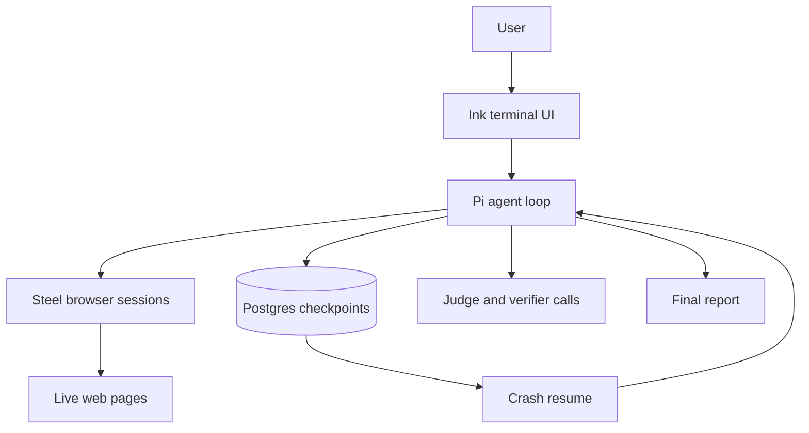
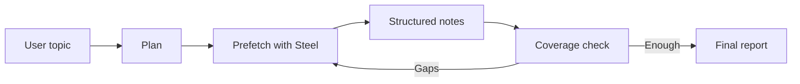

# Durable Researcher: building a research agent that survives its own failures

I have been fascinated by deep research agents for a while now, studying every shape I stumble on. In [part one](https://steel.dev/blog/claude-code-deep-research-autopsy) I took apart the deep-research harness inside Claude Code. This is what happened when I built my own and pointed real evals at it. Then rebuilt it. The first version was good at the wrong thing.

It wrote beautiful overviews. It planned sub-queries, browsed in parallel, took notes, checked its coverage, and produced a polished report. Ask it to survey a field and it shined. Ask it for one number, like a cash-flow figure from a filing, and it handed you a thoughtful essay about the company instead.

So I added a citation verifier. It checked every claim in the report against the agent's notes and triggered a rewrite when the evidence was thin. Clean. Obviously the kind of thing a research agent should have.

The evals said it made things worse. I switched it off.

It is back on today. The eval did not kill the feature — it killed my first build of it, and switching it off gave me time to understand why.

Build what seems right. Test it on real tasks. Read the failures. And when the data turns on you, quarantine your cleverness until you understand it.

## The System

Durable Researcher takes a topic, plans sub-queries, runs them in parallel against real browser sessions on [Steel](https://steel.dev), takes structured notes, checks its own coverage, fills the gaps, and writes a report.

Steel is a hard requirement here. The agent needs a real browser session, not plain HTTP fetches. Useful research often sits on pages that render late, redirect, block scrapers, or only reveal content after client-side behavior. A basic fetch misses most of that.

Every model message is checkpointed to Postgres as it happens. If the agent dies, the next run resumes from the last checkpoint. The model never knows it crashed.

The stack is simple: Bun and TypeScript, [Pi](https://github.com/earendil-works/pi) for the agent loop, [Absurd](https://github.com/earendil-works/absurd) for durable execution, [Steel](https://github.com/steel-dev/steel-browser) for browsers, Postgres for persistence, [GLM-5.1](https://open.bigmodel.cn/) for reasoning, and Ink for the terminal UI.

None of it is exotic. The product lives in the fit between the pieces.

[Part one](https://steel.dev/blog/claude-code-deep-research-autopsy) of this series took apart the deep-research harness inside Claude Code and found it single-pass wide: scope once, search once, never let a finding change the next query. This is what happened when I built the deep version and pointed real evals at it.

## The Numbers, With The Caveats Up Front

There are two useful benchmarks for this kind of system. [ResearchRubrics](https://github.com/scaleai/researchrubrics) has 101 tasks with weighted criteria judged by an LLM. [DRACO](https://huggingface.co/datasets/perplexity-ai/draco), from Perplexity, has 100 tasks with a similar shape. For speed and fast iterations, I ran a random 10% subsample of each.

| Benchmark | Judge | Tasks | Score | How to read it |
|---|---|---:|---:|---|
| ResearchRubrics | Gemini default | 10/101 | `59.8%` | Promising, partial |
| DRACO | Gemini 3.1 Pro | 10/100 | `47.1%` | Paper-comparable, weak sample |

For reference, the published full-set ResearchRubrics scores are Gemini Deep Research at `61.5%`, OpenAI Deep Research at `59.7%`, and Perplexity Deep Research at `48.7%`.

LLM-as-judge numbers are useful, but only if every chart says which judge produced them.

So the honest claim is narrow. Promising on ResearchRubrics. Lower-middle on the Gemini-judged DRACO sample. No victory lap.

## Sprint One: Make It Durable

The first sprint built the substrate.

Every assistant message becomes a step in the durable engine. On resume, the engine replays the completed steps and hands the conversation back to the model. There is no notes table. No visited-URL table. Tool calls and their results live in the message log, and the app rebuilds notes and URLs by walking it.

The transcript is the canonical artifact. If the log replays, the state replays.

On top of that I built the research loop:

Planning produces sub-queries. Prefetch fans them out through Steel, searching and scraping the top results for each one in parallel. The agent reads the sources, takes structured notes, and calls an evaluation tool that summarizes coverage. Weak coverage, search again. Good enough, write.

The early version failed in specific ways.

The search results were noisy — a broad query about agent-driven web automation came back with WhatsApp pages, German dictionaries, and a recipe site. A relevance filter with four stacked ranking signals cleaned it up. A very ugly vibe coded monster. It works.

But the better fix was one line in the system prompt: if you already know a relevant URL, browse it directly. Do not search first. Models already know the canonical sources for most well-known topics. Searching the open web before visiting one is just a way to let SEO fight your research.

The other failure mode was search loops — the agent firing queries without ever browsing a page. The rule: no more than two searches in a row without a browse. Searching without browsing is reading the card catalog and never opening a book.

Both rules are the same idea: take the second hop. Read something, let it change what you do next. Most of this project was teaching the agent to do that.

I built the eval harness this sprint too. It downloads the benchmark datasets, runs the agent as a subprocess per task, and judges the output with an LLM. Multiple judges. Batch APIs where they exist.

The harness changed how I read metrics. Once I saw how far a score could swing on the judge alone, I stopped trusting any single number.

## The Diagnosis

After the first sprint, I had Codex review the eval outputs on its own. It named the problem better than I had:

> Durable Researcher was a good synthesizer with weak routing into exact lookup, primary-document extraction, and precision answering.

Exactly right. The agent nailed "write me a thoughtful overview of X." It flubbed "what was Apple's free cash flow in fiscal Q3 2024?" It used the same report-writing shape for both.

The roadmap was not glamorous:

- classify the task before planning
- use a different first turn for exact tasks
- build a real path to primary documents
- produce an evidence table before prose for extraction tasks
- gate completion on whether required values were actually captured
- adapt the output style to the task type

I agreed with every line immediately. But acting on it took me weeks.

## Sprint Two: Route Before You Research

The second sprint started from one premise: the first turn matters more than another tool.

Before planning, the system now classifies the prompt as `lookup`, `extraction`, or `synthesis`. The mode picks the report template and the stop condition.

Lookup answers first and cites one strong source. No executive summary. No five-section report.

Extraction produces an evidence table as the deliverable, with tight analysis underneath.

Synthesis keeps the original report shape.

The interesting part is the override on top. The model kept under-classifying extraction prompts as synthesis. Ask for a specific cash-flow figure from a filing and it came back "synthesis." So I added a narrow rule: a filing word plus an extract verb, or a period marker like a quarter and a year, upgrades synthesis to extraction.

It never pushes anything down, only up, and only on the failure I watched happen. Not elegant. Honest. Every new failure mode leaves another bump in the routing logic.

I added primary-source paths too. Financial and extraction-heavy queries needed a way to reach source documents instead of drifting around the open web. PDF text extraction handles the investor reports that normal scrapers turn to garbage.

It helped. It also exposed a harder truth: having the path is not enough. The agent has to choose it at the right moment.

## The Citation Verifier That Made Things Worse

The verifier was supposed to be the easy quality win. After the report was written, it parsed every citation, found its source, and checked whether the evidence backed the claim. If the pass rate dropped below a threshold, it triggered a rewrite.

The implementation was clean. On a small eval comparison, citation quality fell by `0.19-0.22` absolute points. Verification pulled in secondary sources and dragged citation quality down.

The hotfixes were predictable. Source-authority weighting. Stronger source-selection prompts. Peer-reviewed and government domains up, PR wires and thin aggregators down.

I switched the rewrite off and left verification running in observation mode. The bleeding stopped, and I could finally read the failures without rushing a fix. The rewrite was not wrong in principle — the implementation had specific, findable bugs. Verbatim matching failed paraphrased-but-correct sentences. Multi-citation groups were scored per-source instead of as a bundle. And weak models narrated their own edits mid-rewrite, which the verifier then scored as report text.

I fixed the bugs — semantic matching, OR-scoring for citation groups, edit-narration stripping — and turned the rewrite back on.

The fixed build has not been through the same comparison that killed the first one. By this article's own standard, that means the verdict is pending. The bugs were real and the fixes are tested, but "the bugs are fixed" is not a number.

The eval did not kill the feature. It killed my first build of it, and switching that build off was what gave me room to see why.

## Sprint Three: When the Question Is the Hard Part

Routing decided what kind of answer to produce. It did nothing for questions where the difficulty is the question.

Some questions are disguised. A homophone. A paraphrased proper noun. A reference buried in a casual phrase. The old planner decomposed every topic along literal research lenses, so a question in costume got searched at face value and never cracked.

Now the planner reasons about the question before it writes a single query. It lists explicit interpretations, decodes the oblique reading, and searches both the literal and the lateral version. It treats the user's stated details as fallible clues, because people misremember and approximate. And it carries a needle prior: if a question is dressed up as hard but its literal phrasing would be trivial to search, the surface reading is probably a decoy, and the lateral readings get the weight.

One bug from that work shows how these systems leak. The planner generated the interpretations correctly. A downstream parser dropped the field before it reached the agent, and the renderer never showed it. The lateral reasoning was real, then silently thrown away. Wiring it through changed the agent's behavior more than any prompt line did.

The next problem was subtler, because it looked like good judgment. A single reasoning chain would reach the right answer and then talk itself out of it. On one homophone needle, the agent found the correct answer, decided it was too cute to be real, and dropped it. That is not a knowledge gap. That is a lone reasoner with no second opinion. And re-rolling the same chain is not a second opinion: the same model with the same framing tends to fall into the same hole. A second opinion only helps if it can fail differently from the first.

The fix was redundancy, not a better prompt. Several workers now attack the same question from different readings, each told not to self-reject, and their evidence pools so independent agreement builds into confidence. A full extra agent gets spent only on a top answer nobody has confirmed yet.

Then a separate adversarial pass judges whether the answer is correct, which is a different question from whether a citation is grounded. Skeptics vote. Abstentions are safe. Refuted answers stay in the report as a transparency block instead of vanishing. On the needle that started all this, the chain now surfaces the right answer and lands at medium confidence with a caveat, instead of confidently wrong or confidently silent.

The last piece was depth. Routing made lookups short, which exposed the opposite problem on broad synthesis: reports that were accurate and thin. Survey mode runs several research passes and merges them deterministically into one report, with a single global source list and every citation marker remapped to match, then spends one constrained model pass on the prose. A gap-fill loop and citation chasing push for density instead of letting the writer quit early. On by default.

## The UI Was Not Cosmetic

At first the CLI was a wall of logs. Long stretches of nothing, and no way to tell whether the agent was thinking, browsing, stuck, or dead.

So I built an Ink terminal UI: findings, activity stream, agent status, a token meter, streamed assistant text between tool calls, per-tool progress, a verification indicator. Once the browser work ran through Steel, the UI had to show those sessions too: searches launched, pages opened, scrapes done, failures returned.

The real win is steering. You can type a redirect mid-run, and it lands as a tagged user message before the next model turn. The system prompt teaches the model how to treat it.

That changed the product more than another search tool would have. The agent stopped feeling like a batch job and started feeling like something you can interrupt.

There was a less glamorous durability fix too. Absurd claims tasks with leases, and Ctrl-C kept leaving them behind, so the next run refused to resume for ten minutes. I wanted a hotkey to clear stale leases. The coding agent pushed back: the hotkey treats a symptom. The real fix is to release the lease on a clean exit and auto-clear one held by a dead process on the same host. It was right, so I took it. There is now an orphan reaper for tasks stuck in `running`.

## The Dogfood Loop

The most productive workflow was not complicated:

1. Run the agent on a real, non-trivial topic.
2. Read the full log.
3. Compare the saved report against the scraped pages and task rows in Postgres.
4. Name each problem in one sentence.
5. Write a failing test.
6. Make the change.
7. Read the diff back as a hostile reviewer.
8. Fix what the review finds.

The hostile review earned its place. In one session it caught a high-severity transaction bug in code the coding agent had written that same day. A two-step update that should have been atomic and was not. It never shipped, because the review was part of the work, not a ceremony after it.

That became the discipline: plan, diff, review, fix the review. The agent helps at every step. The judgment stays yours.

## What Stuck

Routing beats tooling. The biggest quality lift I saw came from deciding what kind of task the user asked for before running the loop. Some prompts want a number, some a table, some a report; treating every prompt as an essay is a routing bug, and no tool fixes it.

The conversation is the state. Store tool-derived state anywhere else and you have a second source of truth. If state rebuilds from the log, durability gets simple.

Opacity is the first product bug. If you cannot see what the agent does, you cannot dogfood it. If you cannot dogfood it, you will ship regressions you never saw.

Browser infrastructure is product infrastructure. For a research agent, the browser is not plumbing. It decides what the model can know.

Evals are infrastructure, not a scoreboard. The rewrite felt obviously right. The eval benched it, the autopsy fixed it, and it came back. Judges disagree, so label your judge. And a disabled, tested feature that can return beats an always-on feature everyone hopes is helping.

## What Is Still Open

The full Gemini-judged DRACO run is the big one. The current `47.1%` is a ten-task subsample. The 100-task number is the real comparison.

The verifier rematch. The rewrite loop is back on because its known bugs are fixed, not because it has won the eval that benched it. It owes me a number.

The writer phase needs a redesign. Give the writer a fixed numbered source list and constrain citations to it. Citations should be correct by construction, not repaired after the fact.

Primary-source coverage is still too narrow. Filing systems, XBRL inline tables, investor PDFs, and JS-rendered corporate reports all need stronger paths.

The lease system needs a real heartbeat. Today leases renew on checkpoint completion or explicit calls, so an unusually long thinking turn can still starve one. Fine for normal runs. Not for adversarial ones.

## Coda

Building one agent with help from another collapsed the line between product and tool.

Reading the research agent's outputs carefully turned out to be the same discipline as reading the coding agent's diffs carefully. The terminal UI I built for research is the one I wish coding agents had. The eval harness for research reports is the harness I want for coding-agent PRs.

The lessons transfer because the failure modes rhyme. Make the work visible. Route before acting. Refuse cheap fixes. Retire features when the evidence turns on them.

Ask me again after the writer-separation work lands. I will probably have to revise half of this.
